# M3E-Canvas Visual Audit & Screenshot Catalog

> **Target Application:** `m3e-canvas` (`http://localhost:3005/`)  
> **Source Repository:** `d:\MAJOR-NODES\zOTHER-PEOPLE\m3e-canvas`  
> **Screenshots Location:** `d:\MAJOR-NODES\zOTHER-PEOPLE\m3e-canvas\Screenshots`  
> **Total Captured High-Fidelity Views:** 19 Views  
> **Resolution:** High-DPI Retina (1920×1080 Viewport, 1.25x Device Scale Factor)

---

## 1. Executive Summary

`m3e-canvas` is a modern browser-based design and wireframing canvas built with **Next.js 16 (Turbopack)**, **React 19**, **Motion**, and **Tailwind CSS 4**. It allows designers and engineers to sketch Material 3 Expressive (M3E) mobile and desktop interfaces on an infinite 2D plane and automatically compile the visual scene into structured, copy-pasteable vibe-coding prompts for LLMs (Claude Code, ChatGPT, Gemini, Android Compose, React).

This visual audit documents the complete feature set across 19 dedicated screenshots covering the canvas workspace, component palette, interactive inspector, theme engines, multi-screen framing, device simulation preview, and prompt generator.

---

## 2. Visual Audit Catalog

| # | Screenshot | Key Feature / UI State | Primary Anatomy & Focus |
|---|---|---|---|
| **01** | [`01_canvas_initial_overview.png`](./01_canvas_initial_overview.png) | **Canvas Initial Overview** | Infinite dot-matrix grid, default mobile frame (`Home`, 412×917), left tool rail, top canvas toolbar, zoom/fit pill. |
| **02** | [`02_parts_palette_actions.png`](./02_parts_palette_actions.png) | **Parts Palette (Actions)** | Material 3 Expressive Action components: Filled Button, Icon Button, Floating Action Button (FAB), Split Button, Chips. |
| **03** | [`03_parts_palette_navigation_containment.png`](./03_parts_palette_navigation_containment.png) | **Parts Palette (Navigation & Containment)** | Navigation components (Top App Bar, Nav Bar, Nav Rail, Toolbar, Tabs, Search Bar) & Containment (Cards, Dialogs, Box, Snackbar). |
| **04** | [`04_parts_palette_inputs_content_progress.png`](./04_parts_palette_inputs_content_progress.png) | **Parts Palette (Inputs & Content)** | Form inputs (Text Field, Dropdown, Switch, Checkbox, Radio, Slider, Pickers), Content blocks (Text, Image, Carousel, Map, Divider), and Progress indicators. |
| **05** | [`05_component_selection_inspector.png`](./05_component_selection_inspector.png) | **Component Selection & Property Inspector** | Contextual two-way binding inspector: Live label editing, Icon selector, M3 style swatches (Filled, Tonal, Outlined, Elevated), width/height sizing sliders, and 3×3 alignment matrix. |
| **06** | [`06_icon_picker_popover_grid.png`](./06_icon_picker_popover_grid.png) | **Material Symbols Icon Picker** | Filterable icon search input and responsive grid of Google Material Symbols integrated into the inspector drawer. |
| **07** | [`07_layers_panel_scene_tree.png`](./07_layers_panel_scene_tree.png) | **Layers Panel & Scene Tree** | Hierarchical scene graph of canvas frames, grouped runs, and individual widget layers with drag-reorder handles and lock toggles. |
| **08** | [`08_color_palette_system_light.png`](./08_color_palette_system_light.png) | **Color Palette System (Light Mode)** | M3 Expressive color token engine: Brightness switch, Contrast setting, predefined palettes (Purple, Blue, Green, Coral, Amber, Teal, Mono), and Dynamic Color extraction. |
| **09** | [`09_dark_mode_canvas_theme.png`](./09_dark_mode_canvas_theme.png) | **Dark Mode Canvas Theme** | True-black OLED canvas background, illuminated active frame outline, deep tonal container surfaces, and high-contrast purple accents. |
| **10** | [`10_shape_and_corners_panel.png`](./10_shape_and_corners_panel.png) | **Shape & Corner Roundness Panel** | M3 Expressive corner shape scales: Square, Rounded, Full pill, and custom per-component radius propagation. |
| **11** | [`11_typography_scale_panel.png`](./11_typography_scale_panel.png) | **Typography Scale System** | Typeface switcher (Roboto, Roboto Flex, Roboto Serif, System) and M3 Emphasized headline and label style switches. |
| **12** | [`12_motion_physics_panel.png`](./12_motion_physics_panel.png) | **Motion Physics & Spring Curves** | Standard vs Expressive motion scheme curves controlling spring damping, stiffness, and interactive transitions. |
| **13** | [`13_ai_prompt_panel_generator.png`](./13_ai_prompt_panel_generator.png) | **AI Vibe-Coding Prompt Generator** | Compiles canvas layout state into clean markdown prompts; features target platform toggles (Android Native Compose vs Web React) and 1-click prompt copy. |
| **14** | [`14_interactive_device_preview_modal.png`](./14_interactive_device_preview_modal.png) | **Interactive Device Simulation Preview** | Live, interactive device mockup simulation running inside a mobile bezel with status bar, interactive taps, and screen switcher. |
| **15** | [`15_device_frame_inspector.png`](./15_device_frame_inspector.png) | **Device Frame Inspector** | Screen-level settings: Device presets, frame title, background color swatches, layout tidy, and image/prompt export buttons. |
| **16** | [`16_multi_screen_wireframe_canvas.png`](./16_multi_screen_wireframe_canvas.png) | **Multi-Screen Canvas Wireframing** | Infinite 2D layout showing multiple screens (`Home` and `Screen 2`) side-by-side with standardized gaps (`FRAME_GAP = 80px`). |
| **17** | [`17_desktop_viewport_mode.png`](./17_desktop_viewport_mode.png) | **Desktop Viewport & Adaptive Navigation Rail** | Desktop mode (`1280×800`) demonstrating layout adaptation where the mobile bottom nav converts into a vertical navigation rail alongside a mobile frame. |
| **18** | [`18_ask_ai_modal_dialog.png`](./18_ask_ai_modal_dialog.png) | **Ask an AI (BETA) Modal Dialog** | Dialog for natural language vibe-coding prompts, external LLM drafting, and custom AI endpoint configuration. |
| **19** | [`19_language_selector_menu.png`](./19_language_selector_menu.png) | **Language Selector Menu** | Internationalization menu with instant localization support (English, 日本語, 中文, 한국어). |

---

## 3. Detailed Screenshot Walkthrough

### 01. Canvas Initial Overview
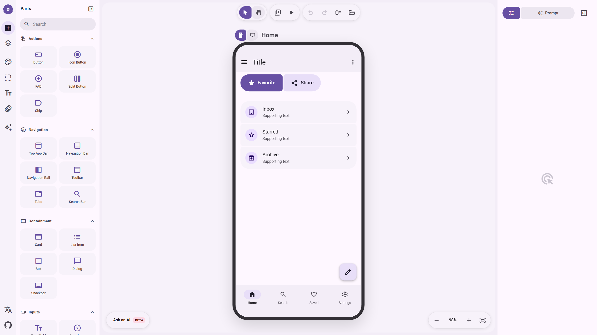
- **Viewport Layout**: Full 3-column workspace with a narrow left tool rail (320px expandable), center infinite canvas, and right inspector drawer.
- **Canvas Physics**: Smooth CSS transform pipeline (`translate(${pan.x}px, ${pan.y}px) scale(${zoom})`).
- **Starter Wireframe**: Mobile Android frame pre-populated with Top App Bar, Favorite & Share action chips, list items, FAB, and bottom navigation.

---

### 02. Parts Palette (Actions)

- **Component Catalog**: Quick drag or click-to-place buttons for Material 3 Expressive actions:
  - **Button**: Standard filled/tonal/elevated button.
  - **Icon Button**: Circular interactive icon target.
  - **FAB**: Floating Action Button with standard/extended variants.
  - **Split Button**: Primary action paired with dropdown menu trigger.
  - **Chip**: Compact filter and action tags.
- **Search & Favorites**: Top search bar with star favoriting system.

---

### 03. Parts Palette (Navigation & Containment)
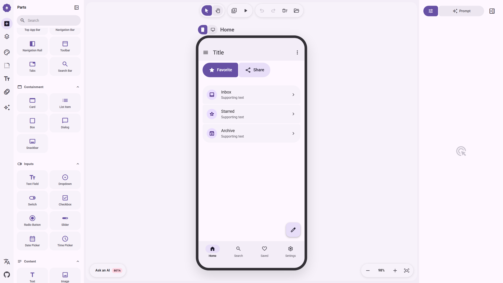
- **Navigation Archetypes**: Top App Bar, Navigation Bar (bottom 4-tab bar), Navigation Rail (desktop vertical rail), Toolbar, Tabs, and Search Bar.
- **Containment Archetypes**: Elevated/Outlined Cards, Dialogs, Bottom Sheet containers, and Snackbar toasts.

---

### 04. Parts Palette (Inputs, Content & Progress)

- **Input Controls**: Outlined and filled Text Fields, Dropdown selectors, Switches, Checkboxes, Radio buttons, Sliders, Date Pickers, and Time Pickers.
- **Content Elements**: Rich Text headers, Images, Carousels, Map placeholders, and Dividers.
- **Progress Indicators**: Linear progress bars and circular loading spinners.

---

### 05. Component Selection & Property Inspector
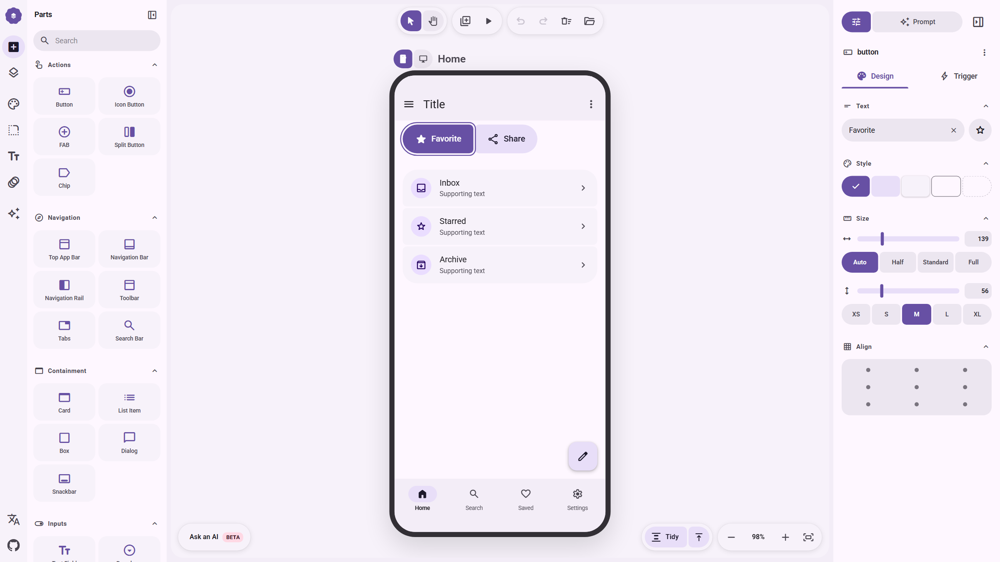
- **Selected Component**: "Favorite" action button with active violet focus halo.
- **Property Inspector**:
  - **Text**: Live input binding with quick clear (`×`).
  - **Icon**: Linked Material Symbol with icon popover trigger.
  - **Style**: Material 3 variant swatches (Filled, Tonal, Outlined, Elevated).
  - **Size**: Width slider (139px) and presets (`Auto`, `Half`, `Standard`, `Full`); Height slider (56px) and scale chips (`XS`, `S`, `M`, `L`, `XL`).
  - **Alignment Grid**: 3×3 matrix for instant snap-positioning inside the parent frame.

---

### 06. Material Symbols Icon Picker
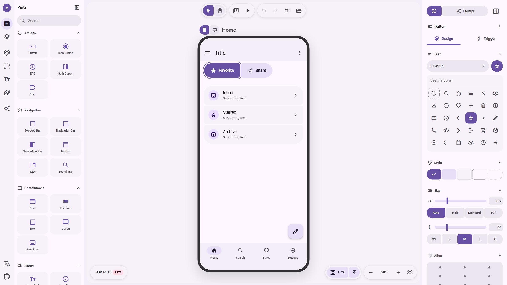
- **Live Search**: Instant keyword filtering across Google Material Symbols.
- **Categorized Grid**: Visual grid of icons (home, search, heart, check, star, edit, settings, mail, info, arrow, user, etc.) with active selection indicator.

---

### 07. Layers Panel & Scene Tree
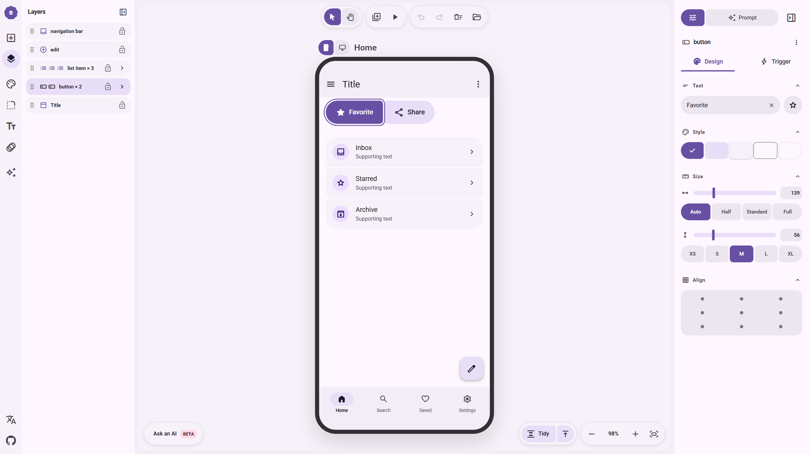
- **Scene Hierarchy**: Tree representation of all canvas objects:
  - `navigation bar` (bottom rail)
  - `edit` (FAB)
  - `list item × 3` (inbox, starred, archive)
  - `button × 2` (favorite, share)
  - `Title` (top app bar)
- **Operations**: Drag handle for z-index ordering, lock toggle (`lock_open`), and group expansion chevrons.

---

### 08. Color Palette System (Light Mode)
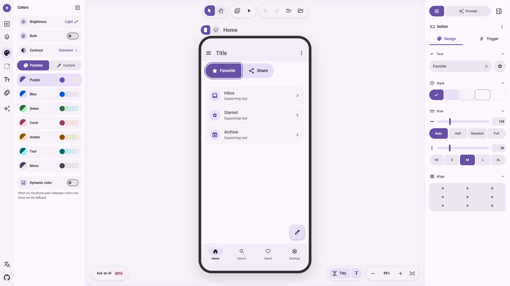
- **Tonal Palettes**: Pre-computed harmonized palettes: Purple (`#6750A4`), Blue, Green, Coral, Amber, Teal, Mono.
- **Controls**: Brightness (Light/Dark), Contrast (Standard/High), Custom hex input, and Dynamic Color toggle.

---

### 09. Dark Mode Canvas Theme
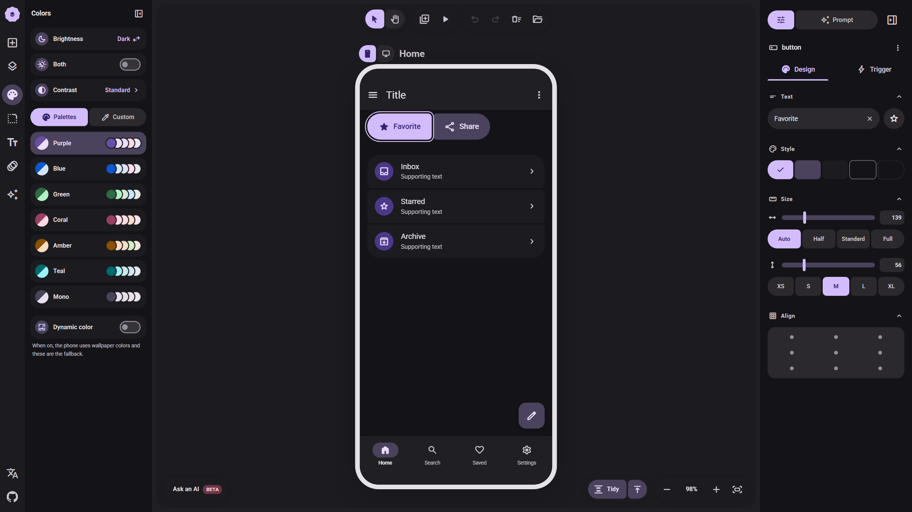
- **OLED Surface**: Deep dark `#121212` background for high battery efficiency and low eye strain.
- **Frame Bezel**: Clean white/translucent frame edge highlights the phone boundaries.
- **Container Roles**: Surface containers adapt with tonal depth layers.

---

### 10. Shape & Corner Roundness Panel
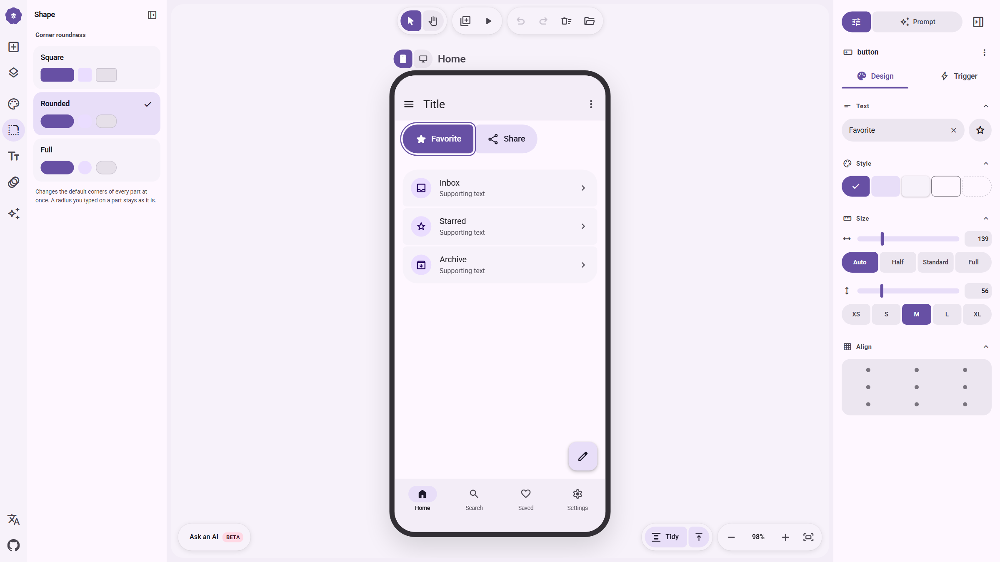
- **M3 Expressive Shape Tokens**:
  - **Square**: Sharp corners (`0px–4px`).
  - **Rounded**: Default M3 Expressive curvature (`16px–24px`).
  - **Full**: Pill-shaped capsules (`9999px`).
- Preserves explicit radii set on individual widgets while bulk-morphing the defaults.

---

### 11. Typography Scale System
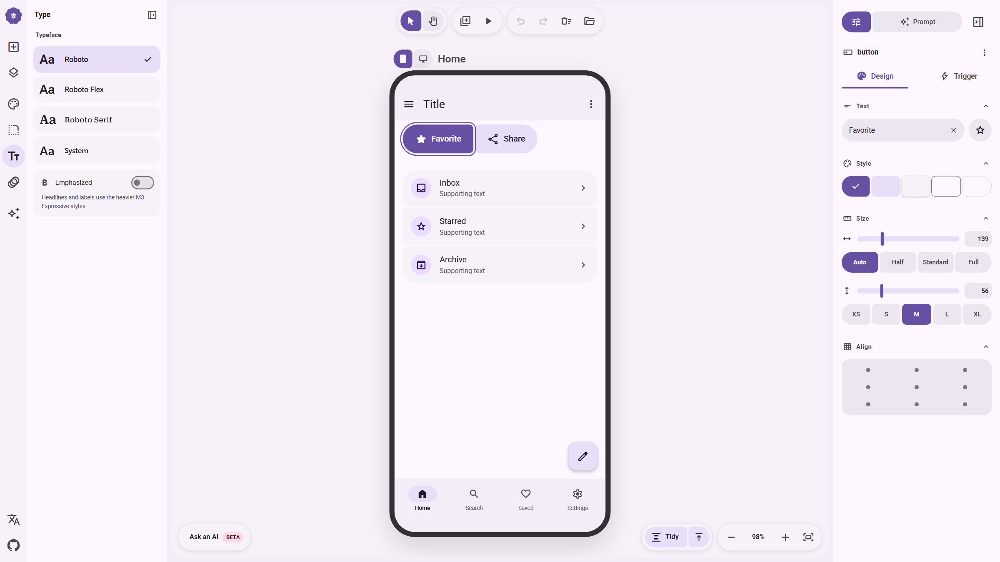
- **Typeface Families**: Roboto, Roboto Flex (variable font), Roboto Serif, and System font.
- **Emphasized Mode**: Toggles heavier M3 Expressive weights for display, headline, and label roles.

---

### 12. Motion Physics & Curves
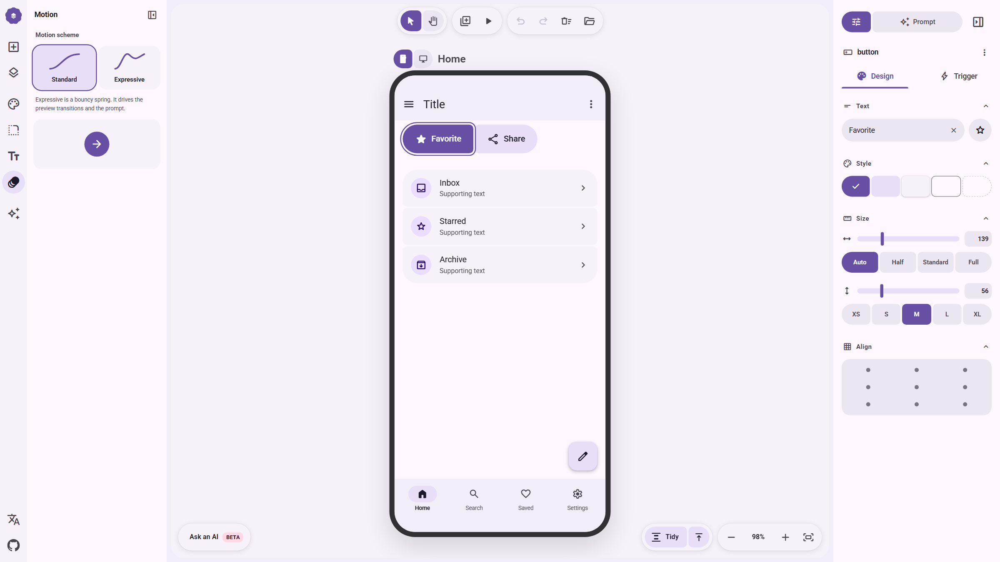
- **Motion Schemes**:
  - **Standard**: Clean, decelerated cubic bezier easing.
  - **Expressive**: Spring-physics animation curves with slight overshoot and bounce.
- Used both for preview interactions and exported into vibe-coding motion specs.

---

### 13. AI Vibe-Coding Prompt Generator
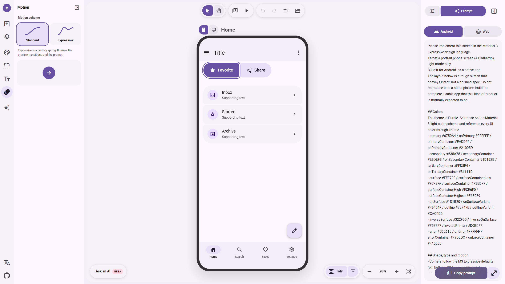
- **Structured Specification**: Compiles the visual canvas into an exact LLM prompt:
  - Framework Target: **Android Native Compose** or **Web React**.
  - Color Tokens: Primary `#6750A4`, Secondary `#635A75`, Surface Container `#ECE6F0`.
  - Component Hierarchy: Tree of widgets, alignments, and sizes.
- **Action**: One-click "Copy prompt" button with full clipboard integration.

---

### 14. Interactive Device Simulation Preview
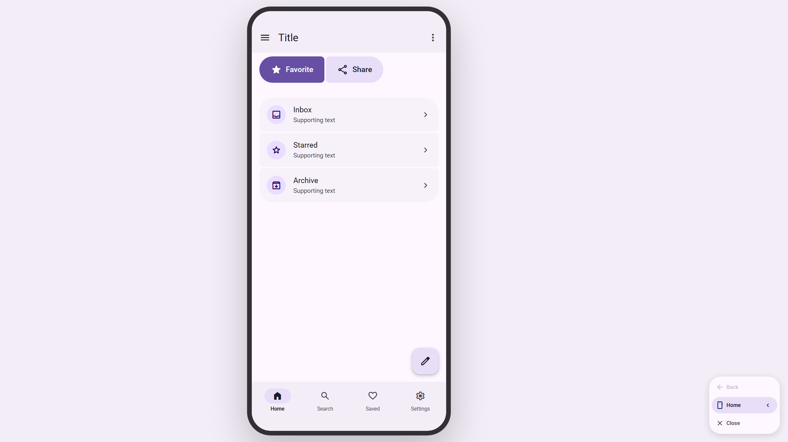
- **Simulation Bezel**: Android hardware frame overlay with rounded display corners.
- **Live React Execution**: Renders interactive buttons, ripple taps, and navigation tab switches directly in the preview modal.

---

### 15. Device Frame Inspector
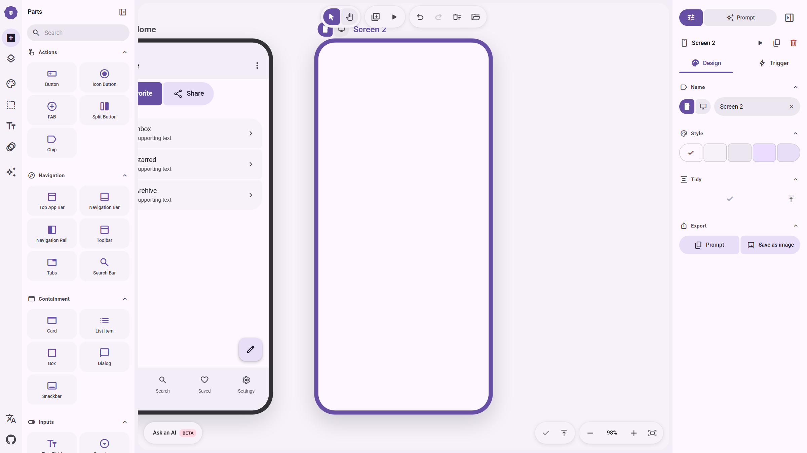
- **Frame Settings**:
  - Screen Name field (`Screen 2`).
  - Device presets: Pixel 8, Galaxy S24, iPhone 15, Desktop 1280×800.
  - Background surface color swatches.
  - Auto-Tidy button to align and pack screen contents.
  - Export: Prompt or Save as PNG.

---

### 16. Multi-Screen Wireframe Canvas
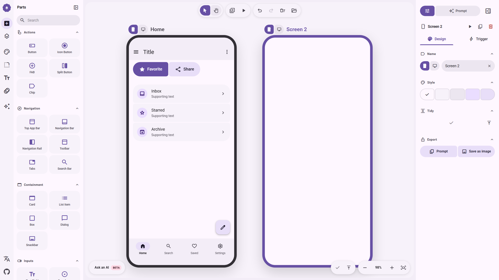
- **Infinite 2D Staging**: Multiple device frames positioned on the canvas with 80px separation.
- **Storyboarding**: Allows designing multi-step user onboarding flows, checkouts, and navigation transitions side-by-side.

---

### 17. Desktop Viewport & Adaptive Navigation Rail
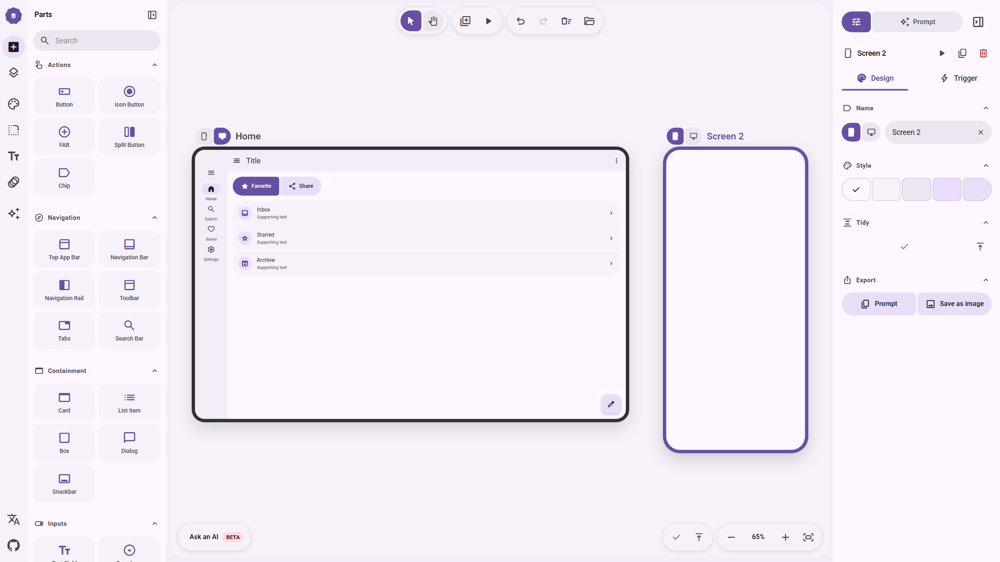
- **Responsive Transformation**: Desktop mode (`1280×800`) automatically converts the mobile bottom navigation bar into a vertical Navigation Rail on the left side of the frame.
- **Cross-Platform Staging**: Allows mobile and desktop screens to coexist on the same design canvas.

---

### 18. Ask an AI (BETA) Modal Dialog
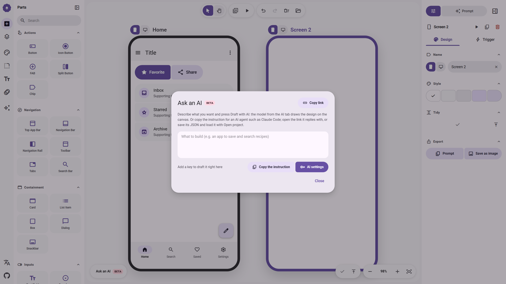
- **Vibe-Coding Assistant**: Natural language input box ("What to build") for generating full screens via external AI agents (Claude Code, Gemini, OpenAI).
- **Prompt Copying**: Generates instructions formatted for external coding CLIs.

---

### 19. Language Selector Menu
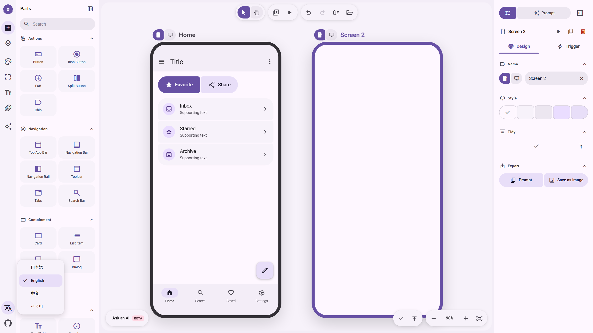
- **Internationalization**: Instant multi-language UI switching between English, Japanese (日本語), Chinese (中文), and Korean (한국어).

---

## 4. Key Architectural Takeaways for Growth Design Studio

1. **Dual Coordinate System**: Infinite canvas panning/zooming via CSS transforms (`pan.x, pan.y, zoom`) combined with relative frame bounding boxes (`f.x, f.y`) provides an effortless multi-screen storyboard experience.
2. **Deterministic Selection via Scene Tree**: Using the Layers panel alongside canvas pointer hit-testing ensures 100% reliable component selection, especially for nested widgets.
3. **Reactive Inspector Architecture**: Decoupling the property drawer into widget-specific inspectors (`ButtonInspector`, `PartInspector`, `FrameInspector`) keeps the codebase modular and clean.
4. **Vibe-Coding Spec Generation**: Compiling the entire visual AST into structured markdown prompts bridges the gap between visual wireframing and production-grade agentic coding.
